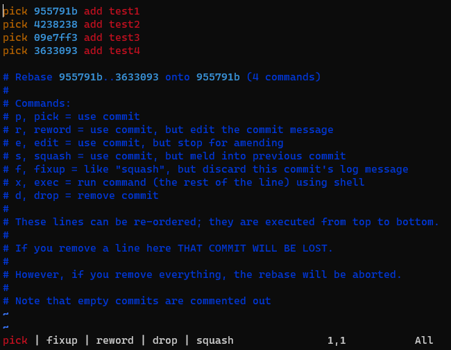

# Shift based git rebase using vim

[`vimscript`](gitrebase.vim) concentrating on shortcuts using the `Shift` key, instead of relying on commands.

Placing the following script to the `~/.vim/after/ftplugin/gitrebase` will enable these shortcuts only for the `git rebase` command editing.


## Change command

Upon the cursor is on a a commit line, the command can be changed by `Shift+Left/Right`. The command list appears on the bottom coloring the selected command. The command list wraps around and no need to go back to the beginning from the end. `Enter` can be also used to select the next command.




## Reorder commits

In case of a single commit, the line can be moved by the `Shift+Up/Down` shortcut.


For moving multiple lines, the visual line mode is required, which can be activated by `Shift+v`. After the mode is active, the lines can be selected by the `Up/Down` keys, which can be also moved by `Shift+Up/Down` just like for a single line. But, this visual line has to be exited to get back the other features in the normal mode by pressing the `Esc` key.


Hint: To delete a commit you may type `d` two times to delete the current line in normal mode.


## Save & close

`vim` can save and close in normal mode by two capital `Z` (`Shift+z`, `Shift+z`) without any customization. Changing the second `Z` to `Q` closes the document without saving (`Shift+z`, `Shift+q`).


## Customize

Not all the git rebase commands are available in the selection. To extend or reorder the list of commands, only the `s:cmds` has to be simply edited in the top of the script.


## Problems with `byobu`/`tmux`

The `Shift` based commands are occupied by using `byobu` for terminal multiplexing.
To make this script work with it, the bindings has to be disabled.
For this, the following has to be added to the `~/.byobu/keybindings.tmux` (create if does not exist already).

```
unbind -n S-Left
unbind -n S-Right
```

`tmux` activated terminal type can also be problematic as the default `$TERM` (`screen-256color`) does not handle the `Shift+ArrowKeys` escape sequences well. To fix this ensure that the xterm key handling is enabled with the following settings in the  `~/.byobu/.tmux.conf` file.

```
setw -g xterm-keys on

setw -g default-terminal "screen.xterm-256color"
```

You may use other terminal like `xterm-256color`.
